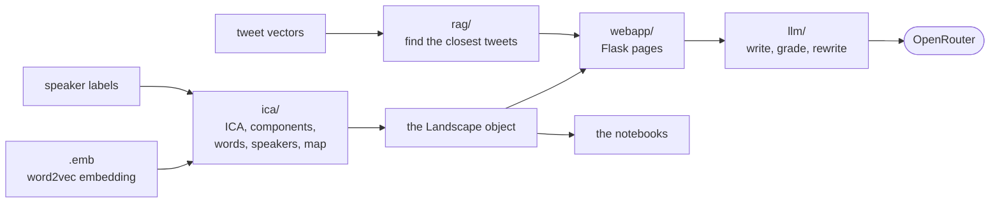

# How the project is put together

## What it does

The corpus is a collection of South African tweets about vaccination in 2021,
split into four phases of the rollout. A word2vec embedding was trained on it
in which the speakers are words too: every tweet line begins with a token
naming its author, so an account ends up with a vector in the same space as the
vocabulary it uses.

The app takes that embedding apart with ICA. Each resulting *component* is a
direction in the space that a small set of words and accounts sit at the
extremes of — read together, those extremes are what makes a component
interpretable as a theme. For each component the app shows the words and
speakers that characterise it, a 2-D map of where every speaker falls, the real
tweets closest in meaning to any word, and what an LLM makes of those tweets.

Two questions sit on top of that: *what does this word mean in this corpus*
(the narrative pages) and *how do language models frame it* (the frames pages).

## The shape

**One long-lived process.** Everything on the left of that diagram is computed
once, when the app starts, and then shared by every visitor. This is why the
first start takes so long and every later one is quick: the ICA and the 2-D map
are saved to disk and reloaded. It is also why the app is a server rather than
a script — the alternative would be paying that cost on every click.

**The analysis does not know the web exists.** `ica/` and `rag/` contain no
Flask and no LLM code; `webapp/` contains no analysis. The two notebooks drive
exactly the same `Landscape` object through sliders that the web app drives
through URL parameters. A change to the analysis therefore lands in both
front-ends at once, and neither can drift from the other.

## The four parts

| | What lives there |
| --- | --- |
| `config.py` | Every file path, in one place, plus reading `.env`. `DATA_DIR` is the only thing that ever needs configuring. |
| `ica/` | The analysis: load the embedding, decompose it, derive the characteristic words and speakers of each component, compute the 2-D map, colour the speakers by stance, draw the figure. `landscape.py` is the centre of the project — it holds the state and turns a set of parameters into a figure and its word tables. |
| `rag/` | Retrieval: given a word, find the tweets closest to it in meaning. Its subfolder `encode_corpus/` is the one-off GPU job that produced the tweet vectors, and is not run by the app. |
| `llm/` | Everything to do with models. `prompts/` is text and calls nothing; `pipeline/` is the process that sends it and reads the answer. OpenRouter is the only provider. |
| `webapp/` | Flask: the pages, the URL parameters, the background runs, the HTML and the JavaScript. Display only. |

## The pages

| Page | What it is |
| --- | --- |
| `/` | The landscape: choose a component and a phase, get the map and the word tables. Asking for the narrative of a single word happens here too. |
| `/bulk` | The same narrative pipeline over a whole list of words, run in the background, followed by a merge of the results. |
| `/comparison` | Several writer models against several grader models over the same words, to compare how they score each other. |

The frames pages are the same two machines with frame-analysis prompts loaded
instead of narrative ones — they are extra URLs, not extra pages, and they
reuse the bulk and comparison code rather than copying it.

Because a bulk run takes minutes, runs are stored in a small SQLite database
(`tasks.db`) rather than held in memory: you can close the tab, come back
later, and download the results as CSV. A run that was interrupted keeps the
words it had already finished. Deleting a run is also how you cancel one that
is still going.

## The LLM pipeline

Every model call in the project goes through one class, and the loop is always
the same: **write → grade → rewrite once**. Three graders ask three different
questions — a rubric judgement, a fact-by-fact verification of the answer
against the tweets it was based on, and whether it respected its length budget.
Each critique is handed back for a single rewrite.

That loop runs at four *levels*: a narrative of one word, the merge of a whole
list of narratives, a frame analysis, and the merge of those. The four are the
same code with different prompts and settings — the levels are declared as data
in one table (`llm/pipeline/levels.py`), so adding a fifth means adding a row,
not writing a class. **This is the thing to understand before touching any
prompt**: change the text in `llm/prompts/`, and every level that uses it
follows.

Model calls are retried a few times, because roughly one call in ten comes back
as an error, and each call is given a hard deadline so one hung request cannot
stall a whole run.

